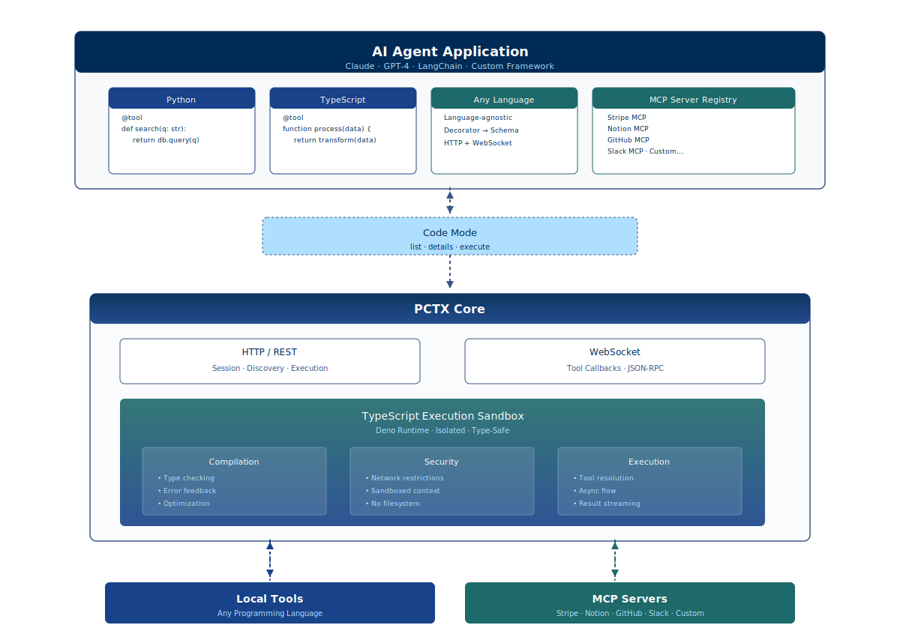

<div align="center">
  
  <h1>pctx</h1>

[](https://portofcontext.com)

[](https://www.npmjs.com/package/@portofcontext/pctx)
[](https://www.rust-lang.org)
[](https://pctx.readthedocs.io/en/latest/)

</div>

<div align="center">

The open source framework to connect AI agents to tools and mcp with [Code Mode](#what-is-code-mode)

</div>

## Install

```bash
# Homebrew
brew install portofcontext/tap/pctx

# cURL
curl --proto '=https' --tlsv1.2 -LsSf https://raw.githubusercontent.com/portofcontext/pctx/main/install.sh | sh

# npm
npm i -g @portofcontext/pctx
```

## Core Functionality
pctx can be run as a stateless HTTP server for Code Mode sessions or as a unified MCP server that exposes Code Mode functionality for registered upstream MCP servers.

```bash 
# Start Code Mode for Python SDK
pctx start

# Start Code Mode as a unified MCP server
pctx mcp init
pctx mcp dev
```

## Python SDK
Use the Python SDK if building agents in Python and want to run Code Mode with custom tools and/or MCP servers. The Python SDK is an HTTP client to the `pctx` server.
```bash
uv pip install pctx-client
```
```python
from pctx_client import Pctx, tool
from agents import Agent # Use any Agent SDK
from agents.run import Runner # This example is OpenAI Agents SDK

@tool
def get_weather(city: str) -> str:
    """Get weather information for a given city."""
    return f"It's always sunny in {city}!"

pctx = Pctx(tools=[get_weather]) # or with mcp: servers=[your_mcp]

tools = pctx.openai_agents_tools() # Run Code Mode with any Agent SDK
agent = Agent(
    name="GreatCoder",
    model="litellm/openrouter/openai/gpt-oss-120b",
    instructions="You run code to complete complex tasks.",
    tools=tools,
)
```
Complete Docs: [Python SDK Quickstart and Docs](./pctx-py/README.md)

## Node SDK
Coming soon

## Unified MCP
Use the unified MCP to run Code Mode with MCP servers and want to persist the authentication connections and you do not need to register local tools.

```bash
# Initialize config for upstream mcp connections
pctx mcp init

# Connect to any MCP server
pctx mcp add my-local-server http://localhost:3000/mcp
pctx mcp add stripe https://mcp.stripe.com

# Start the unified MCP server in dev mode
pctx mcp dev

# copy server url and connect to agents with --transport http
```

For complete CLI documentation, see [CLI.md](docs/CLI.md).
For configuration options, see [Configuration Guide](docs/config.md).


## What is pctx?

`pctx` sits between AI agents and MCP servers. It aggregates multiple upstream MCP servers, handles authentication, and exposes tools through a unified [Code Mode](#what-is-code-mode) interface. Instead of agents managing connections to individual MCP servers, they connect once to pctx.

## What is Code Mode?

Code mode replaces sequential tool calling with code execution. Rather than an agent calling tools one at a time and passing results through its context window, it writes code that executes in a sandbox. Read Anthropic's overview [here](https://www.anthropic.com/engineering/code-execution-with-mcp).

**Traditional MCP flow**:

1. Agent calls `getSheet(id)`
2. Server returns 1000 rows → agent's context
3. Agent calls `filterRows(criteria)`
4. Server returns 50 rows → agent's context

**With Code Mode**:

```typescript
const sheet = await gdrive.getSheet({ sheetId: "abc" });
const orders = sheet.filter((row) => row.status === "pending");
console.log(`Found ${orders.length} orders`);
```

**Result:** 98.7% reduction in tokens (150k → 2k) for this multi-step operation.

## Features

- **Code Mode interface**: Tools exposed as code functions for efficient agent interaction. See [Code Mode Guide](docs/code-mode.md).
- **Upstream MCP server aggregation**: Connect to multiple MCP servers through a single interface. See [Upstream MCP Servers Guide](docs/upstream-mcp-servers.md).
- **Simple config with CLI**: Create the pctx.json config with a simple CLI. pctx.json manages auth, upstream MCPs, logging, and more. See [Config Guide](docs/config.md).
- **Secure authentication**: Source secrets from environment variables, system keychain, and external commands. See [Authentication Section](docs/config.md#authentication) in the CLI configuration docs for more details.

## Architecture


## Security

- LLM generated code runs in an isolated [Deno](https://deno.com) sandbox that can only access the network hosts specified in the configuration file.
- No filesystem, environment, network (beyond allowed hosts), or system access.
- MCP clients are authenticated in pctx. LLMs can never see your auth.

## Update

Depending on the installation method (Homebrew/npm/cURL) the update method is different. Run `which pctx` if you are unsure what you used to install it.

```bash
# Homebrew update
brew upgrade pctx

# cURL update
pctx-update

# npm update
npm upgrade -g @portofcontext/pctx

```

## Learn More

- [Model Context Protocol (MCP)](https://modelcontextprotocol.io/)
- [Code execution with MCP by Anthropic](https://www.anthropic.com/engineering/code-execution-with-mcp)
- [Code Mode explanation by Cloudflare](https://blog.cloudflare.com/code-mode/)
